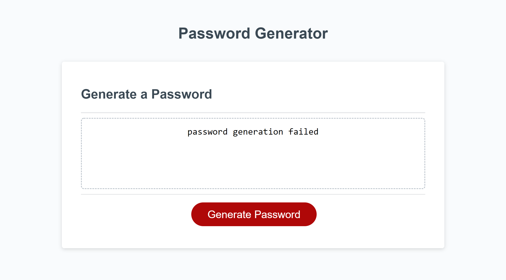
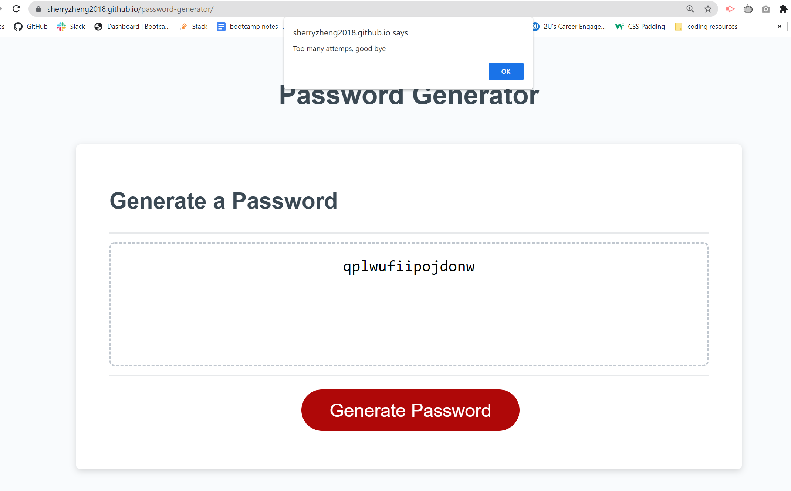
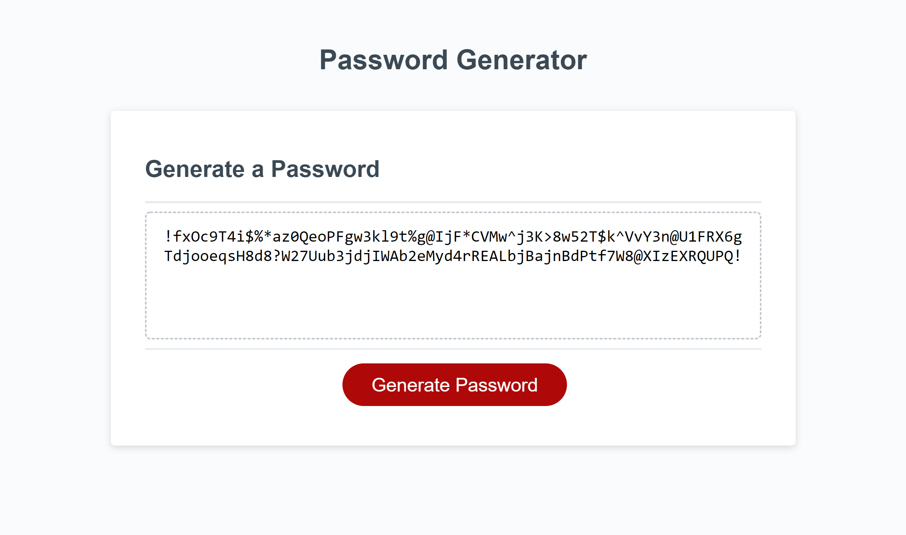

# password-generator

### This password generator includes the following features:

* When you click the "Generate Password" button, a prompt shows asking "How many charactors do you want in the password?". Length of the password should between 8 to 128 charactors. 
* There are four types of criteria for you can choose to include in the password, lowercase, uppercase, number and special charactors. You should select at least one charactor type.
* After answering each of the prompt, a password matches your choices is generated, and is displayed in the password box.
* More than two failure attempts will determinate generating the password. But you could start over by clicking "Generate Password" button.

### https://sherryzheng2018.github.io/password-generator/

